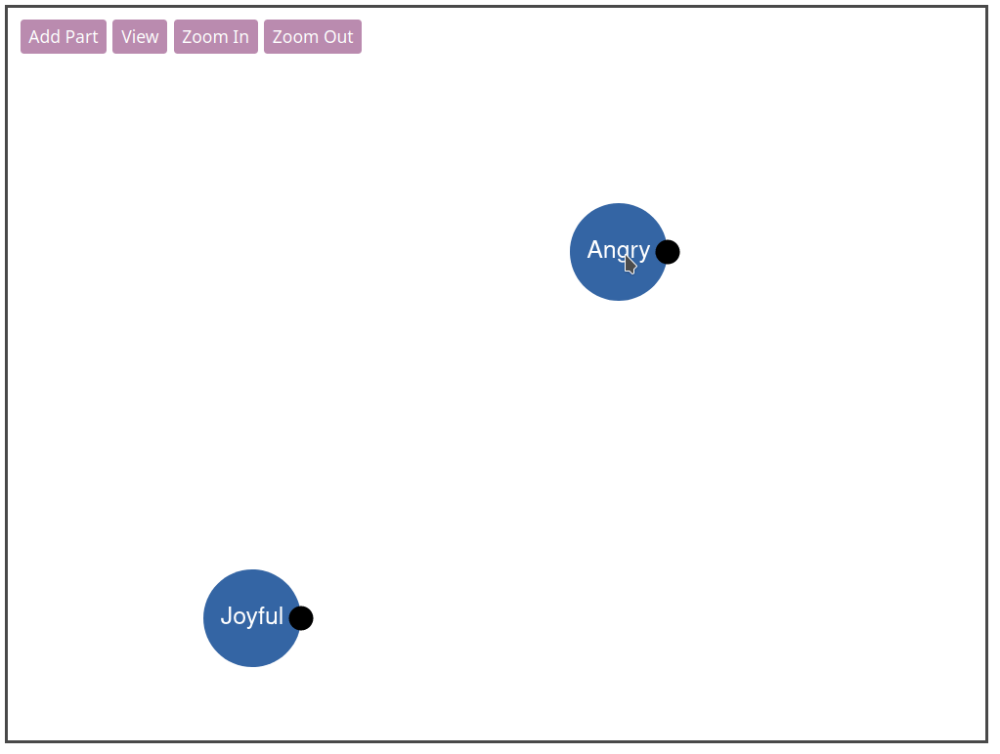

## Introduction

This is an unfinished side project I created. I learned a lot while building it!

The idea is that one could track what parts of their mind are present to assist in [self-IFS](https://ifs-institute.com/resources/articles/internal-family-systems-model-outline).

[Try the demo here!](https://parts-work-demo.lamdera.app/)

You can:
* Drag parts around to different locations
* Use the black circle to resize a part
* Add new parts
* Create and reuse a login to save your work



It utilizes [Lamdera](https://www.lamdera.com/) to create an app with:
* Persistent users
* Collision detection between parts
* SVG Animation

## Usage

Try the app locally with:
```
lamdera live
```

## License

This project is licensed under the [MIT License](./LICENSE).
